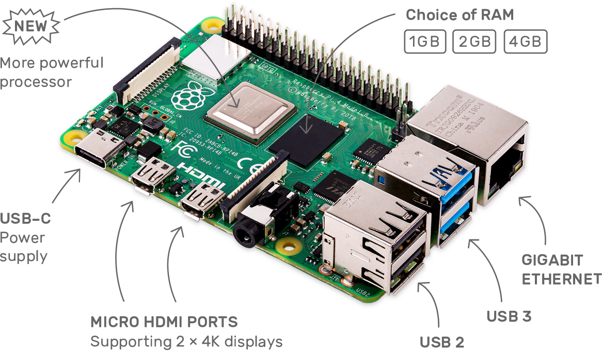

# Raspberry Pi

## Raspberry Pi 4

### Features

The speed and performance of the new [Raspberry Pi 4](https://www.raspberrypi.org/products/raspberry-pi-4-model-b/) is a step up from earlier models. The fanless, energy-efficient Raspberry Pi runs silently and uses far less power than other computers. Raspberry Pi 4 comes with Gigabit Ethernet, along with onboard wireless networking and Bluetooth. The new Raspberry Pi 4 has upgraded USB capacity: along with two USB 2 ports there are two USB 3 ports, which can transfer data up to ten times faster. The Raspberry PI 4 has support for up to two 4K displays through its two Micro HDMI Ports.

### Specifications

| **Spec** | **Raspberry Pi 4 B** | **Raspberry Pi 3 B+** |
| :--- | :--- | :--- |
| **CPU** | 1.5-GHz, Quad-Core Broadcom BCM2711B0 \(Cortex A-72\) | 1.4-GHz, Quad Core Broadcom BCM2837B0  \(Cortex A-53\) |
| **RAM** | 1 - 4GB DDR4 | 1GB DDR2 |
| **GPU** | 500 MHz VideoCore VI | 400 MHz VideoCore IV |
| **Video Out** | dual micro HDMI ports | single HDMI port |
| **Max resolution** | 4K 60 Hz + 1080p or 2x 4K 30 Hz | 2560 x 1600 |
| **USB Ports** | 2x USB 3.0 / 2x USB 2.0 | 4x USB 2.0 |
| **Wired Networking** | Gigabit Ethernet | 330 Mbps Ethernet |
| **Wireless** | 802.11ac \(2.4 / 5 GHz\), Bluetooth 5.0 | 802.11ac \(2.4 / 5 GHz\), Bluetooth 4.1 |
| **Charging Port** | USB Type-C | micro USB |
| **Power Requirement** | 3A, 5V | 2.5A, 5V |
| **Size** | 3.5 x 2.3 x 0.76 inches \(88 x 58 x 19.5mm\) | 3.2 x 2.2 x 0.76 inches \(82 x 56 x 19.5mm\) |
| **Weight** | 0.1 pounds \(46 grams\) | 0.11 pounds \(50 grams\) |

## Raspberry Pi Zero W

### Features

The Raspberry Pi Zero W extends the Pi Zero family. Launched at the end of February 2017, the Pi Zero W has all the functionality of the original Pi Zero, but comes with with added connectivity, consisting of:

* 802.11 b/g/n wireless LAN
* Bluetooth 4.1
* Bluetooth Low Energy \(BLE\)

Like the Pi Zero, it also has:

* 1GHz, single-core CPU
* 512MB RAM

### **Specifications**

| Spec |  |
| :--- | :--- |
| CPU | Broadcom BCM2835 application processor, 1GHz ARM11 core \(40% faster than Raspberry Pi 1\) |
| RAM | 512MB of LPDDR2 SDRAM |
| Storage | A micro-SD card slot |
| Video Output | A mini-HDMI socket for 1080p60 video output |
| Power | Micro-USB sockets for data and power |
| GPIO | Un-populated 40-pin GPIO header \(same pinout as Model A+/B+/2B/3B\) |
| Connectivity | 2.4GHz 802.11 b/g/n Wi-Fi, Bluetooth 4.1 LE |

#### Teams Contributed to this Article:

* [BLRS](https://purduesigbots.com/) \(Purdue SIGBots\)

