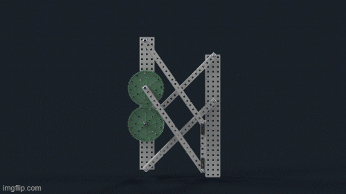
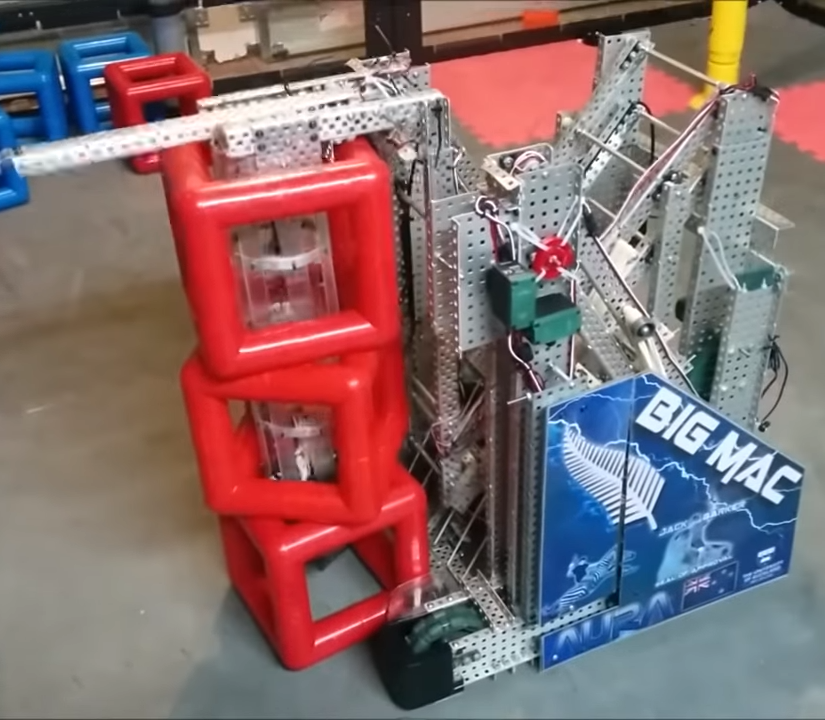
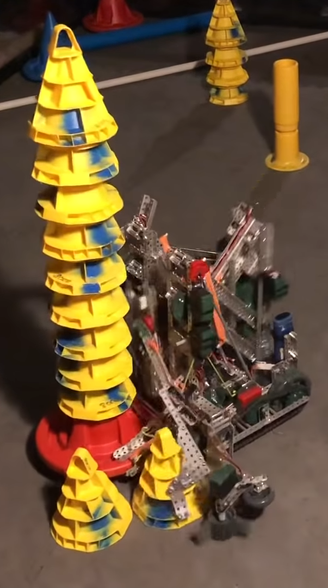
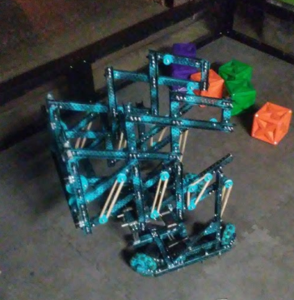

# Double Reverse Four Bar (DR4B or RD4B)

The double reverse four bar (also referred to as DR4B or RD4B) lift is one of the more complicated lift designs used in VEX Robotics competitions. The lift is comprised of two iterations of a four bar lift. One iteration is mounted in the same manner as for a standard four bar lift. The second iteration is mounted at the end of the first iteration at the location where the intake or object manipulation mechanisms would normally be positioned. The second four bar lift faces the opposite direction as the first iteration. This allows the overall lift to rise almost completely vertically as opposed to a single four bar lift that rises forward and up simultaneously. This can be an advantage or disadvantage depending on the desired task.

Double reverse four bar lifts keep the weight of a load centered over the base of the robot instead of lifting it up in front of the robot. To be more specific, the center of gravity of the robot goes slightly backwards before going forwards when lifting a load up. This helps prevent the robot from tipping over. The double reverse four bar lift has a significant height advantage over a four bar lift without the lifting the load in front of the robot. The double reverse four bar lift design is much more complex than a four bar lift or a six bar lift and thus is more difficult and time consuming to build. Double reverse four bar lifts must be carefully constructed, coded, and maintained to ensure optimal functionality. They are more prone to breaking parts and motors than other lift designs.

### Pros and Cons Analysis

| Pros                                                                                                                                                                                                                                                                                                                                                 | Cons                                                                                                                                                                                                                                     |
| ---------------------------------------------------------------------------------------------------------------------------------------------------------------------------------------------------------------------------------------------------------------------------------------------------------------------------------------------------- | ---------------------------------------------------------------------------------------------------------------------------------------------------------------------------------------------------------------------------------------- |
| <ul><li>Relatively linear lift compared to single stage bar lifts (e.g. <a href="six-bar.md">six bar</a> or<a href="four-bar.md"> four bar</a>).</li><li>If built properly, can reach higher than a single stage lift on its own.</li><li>A <a href="six-bar.md">six bar</a> can replace the top four bar stage for space or extra height.</li></ul> | <ul><li>Relatively harder to build (and code) compared to most lifts.</li><li>Is more prone to issues when asymmetrically built due to having two stages.</li><li>Much more heavy and space consuming due to being two stages.</li></ul> |

## Weight Classes of Double Reverse Four Bars

Depending on whether or not the lift needs speed, height, or torque the core design of the lift changes.

Lifts that are designed for height are usually more heavy because they have **longer arm lengths** and have **a series of bracing and supports** so that the lift and reach its maximum height efficiently keeping the lift very stable and lifting straight up and down without leaning to the right or left.

Lifts that are designed of speed are **significantly lighter** than height based DR4Bs so that they have less inertial mass. Things that have less inertial mass are more susceptible to changes in velocity allowing the lift to move up and down very quickly and with significantly reduced recoil.

In reality the lift should designed be somewhere in the middle of tall and fast because a short and slow lift is useless. That's why there is 4 main weight classes of DR4B designs:

* **Heavyweight**
* **All Round**
* **Lightweight**
* **Featherweight**

These terms are fairly arbitrary and are just to group together similar designs. Rather than exact definitions it is better to think of these weight classes as a spectrum and as the lift can take design aspects of each weight class to better fit what it needs.

**Heavyweight**

 (1) (1).png>)

This weight class is typically only found in VEXU because of size and motor restrictions. But nonetheless highlights important design considerations to make an all rounded lift more sturdy and stable. It should also be noted that its ability to be used as a 24" robot as a relatively wide lift allows for more cross bracing between the two sides of the lift (as shown in the "Big Chungus" pictures), or potentially another subsystem if the team plans accordingly.

Characteristics:

* Powered from bottom and middle
* Heavy Top Manipulator
* Boxed C Channels
* Very Tall
* Lots of C Channel bracing
* Lots of rubber bands to counteract the weight of lift and manipulator
* Strong drive train to be able to move around lift as well as the game objects without getting tired

**All Round**

 (1) (1).png>)

An extremely reliable lift with 2 motors that is both quick and tall is easy to do the with the power of V5 motors. This type of lift is going to fit the needs of most applications.

Characteristics:

* 2 V5 Motors
* Powering motors are in the middle
* Found with decent amount of cross bracing
* Typically done with Double Reverse Four-Six Bars to increase height.
* Recommended to use 2 V5 Motors
* Powered in the middle
* structurally made almost entirely of 2 wide channels

**Lightweight**

.png>)

The lightweight weight class is a good option for motor count efficiency or lighter game elements (Example: Cones in In The Zone and Caps in Turning Point).

Characteristics

* Potentially could be powered with 1 V5 Motor
* Stand off bracing
* Can typically be found with half-cut C-channels to reduce weight.
* Typically done with Double Reverse Four-Six Bars to increase height.
* Lighter weight intakes to reduce strain on lift itself

**Featherweight**

This design of double reverse 4 bar is a very niche weight class and strips down the "Double Reverse" design to its bare minimum to create a very space efficient lift. These designs typically have another actuating device or lift on the end of the lift and can be used

* Similarly to the lightweight class, these have smaller intakes for reduced strain on the lift.
* Lift towers are mounted very close together.
* Instead of having two sides, the upper portion of the lift in this class normally consists only of one centralized section (as shown in picture above).
* Mounting intakes on this lift is typically harder due to the lack of two mounting points on two sides of a normal DR4B.

## The "Double Reverse" Design

One thing that may be important to note is that the "Double Reverse 4 Bar" design is just an umbrella term for the "Double Reverse" design as a whole. The "Double Reverse" design is not rigid that requires have 2 four bars. The only requirement for a lift to be a "Double Reverse" design is to have one lift with another mechanically connected lift on top of it. This is important because the main idea of the "Double Reverse" design is to combine the heights of 2 bar lifts. Combine the knowledge of other bar lifts and linkages to be able to design the perfect lift for the job.

The following lifts are not "DR4Bs" and use different techniques to make the lift taller.

.png>)

## Consensus

These can be regarded as difficult, but they are much more stable, compact, and easy to maintain than other lifts that reach similar heights. This type of lift has been incredibly popular for both the Skyrise and ITZ seasons, and for good reason.

