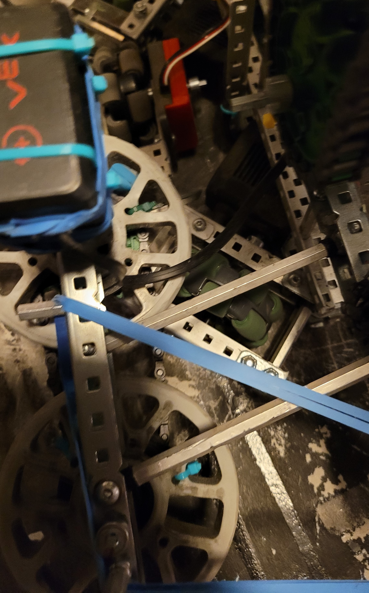

# Four Bar

The four bar lift is one of the most used lifts in VEX Robotics competitions due to its relative simplicity and ease of building. The four bar lift is constructed using two sets of parallel bars that move up and down in unison. Two sets of vertical bars line both the front and back of the linkage, so that the lift can be attached to a robot base parallel to to object interaction mechanisms being attached.

In addition to the common parallel configuration, the two rotating bars may be mounting in a non-parallel fashion to provide a set amount of angle change on the lifted end of the lift throughout its range of motion. This can be used to adjust the angle of the linkage in its fully elevated state, in accordance with the design goals and game challenges.

One advantage of the four bar lift is how the lifted end will always remain parallel to the static mounting point through the entire duration of a lift or decent, with the exception of non-parallel mounting as mentioned previously. This helps prevent game objects from falling out of the object interaction mechanisms due the lift being inclined or declined. The simplicity of the design also makes four bar lifts very reliable and low-maintenance. Once one is constructed and set up, very little else is necessary to be done and the lift should continue to function without issues. The low number of moving parts allows little to go wrong during operation, and thus sensors and fail-safes are often not necessary.

Because four bar lifts are simple in nature, the linkage does not provide much height advantage. The maximum height of a four bar lift is determined by the length of bar used, which is constrained by the size limitations of the robot itself. While not common, four bar lifts may result in a center of gravity that does not remain over the base of the robot when faced with a heavy load. However, due to the size limitations, this is not often a problem.

### Pros and Cons Analysis

| Pros                                                                                 | Cons                                                                                           |
| ------------------------------------------------------------------------------------ | ---------------------------------------------------------------------------------------------- |
| Easy to build                                                                        | Lack of height                                                                                 |
| Reliable/Low Maintenance                                                             | Center of gravity is not over the base of the robot (robot could tip when carrying heavy load) |
| Lifted end is parallel to static mounting point, preventing objects from falling out | Lift design is constrained by size of robot                                                    |

### Additional Uses

In addition to the widely used use-case of a vertical lift, four bar linkages can be used for many other applications. For instance, a four bar linkage can be rotated 90 degrees, to move with horizontal motion, rather than vertical. This can be used in many different scenarios such as subsystem deploy and passive mechanisms.

