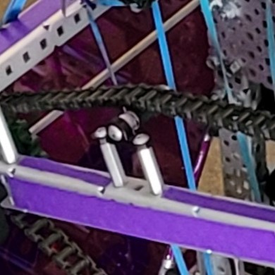

# Gears and Sprockets

Gears and sprockets are both used to transfer motion from a powered to an unpowered object, with the difference between the two being how they carry that motion.&#x20;

### Gears

Gears transfer motion by meshing with each other, turning other gears in a sequence/ratio. They are ideal for covering shorter distances, or larger distances with a long gear sequence. It should be noted, however, that the more gears are added to a sequence, the more friction and energy loss incur, reducing the overall effectiveness.

In addition to carrying motion in a 1:1 ratio, gears can be used to amplify and detract from the speed and torque generated by the motor. For more information on ratios, click [here](../../misc.-vex-parts.md#gear-and-sprocket-ratios). Gears are produced in the following varieties, differentiated by the number of teeth on each gear:

| Gear Sizes: |
| :---------: |
|   12 Tooth  |
|   24 Tooth  |
|   36 Tooth  |
|   60 Tooth  |
|   84 Tooth  |

In addition to the different sizes of gear, gears are also produced in both low and high strength thickness grades. Both high strength and low strength gears can mesh with one another.

### Sprockets

Sprockets transfer motion by using chain to link multiple sprockets together, as individual sprockets themselves should not be physically meshed together. They are ideal for covering longer distances with minimal moving parts, or in scenarios where gears cannot be properly spaced. Although sprockets and chain are more flexible than gears, chain carries the inherent risk of snapping while in use, rendering the driven component motionless.

Similar to gears, sprockets can also function in a ratio. For more information on ratios, click [here](../../misc.-vex-parts.md#gear-and-sprocket-ratios). Sprockets are produced in the following varieties, again being differentiated by the number of teeth:

| Low Strength | High Strength |
| :----------: | :-----------: |
|   10 Tooth   |    6 Tooth    |
|   15 Tooth   |    12 Tooth   |
|   24 Tooth   |    18 Tooth   |
|   40 Tooth   |    24 Tooth   |
|   48 Tooth   |    30 Tooth   |

As described in the chart, sprockets are produced in a both high and low strength varieties. Unlike gears, however, low and high strength sprockets are linked with different size chains, making it impossible to mess high and low strength sprockets.

## Chain Tensioners

The use of chain tensioners provides additional stability to large chain routes on a robot, reducing the likelihood of chain snapping during competition.&#x20;

Chain tensioners are often created by use of a [screw joint](../../vex-joints.md#single-bearing-screw-joint), with the exception of using free-spinning spacers instead of metal to rotate on the screw. As such, no bearing is necessary, as the screw will be stationary on the metal, and spacers require no bearings.

### Teams Contributed to this Article:

* [BLRS](https://purduesigbots.com/) (Purdue SIGBots)
* [94999E](https://www.youtube.com/channel/UCp1jTU7WF3PEVukDW3qOGpA) (Yokai Robotics)
