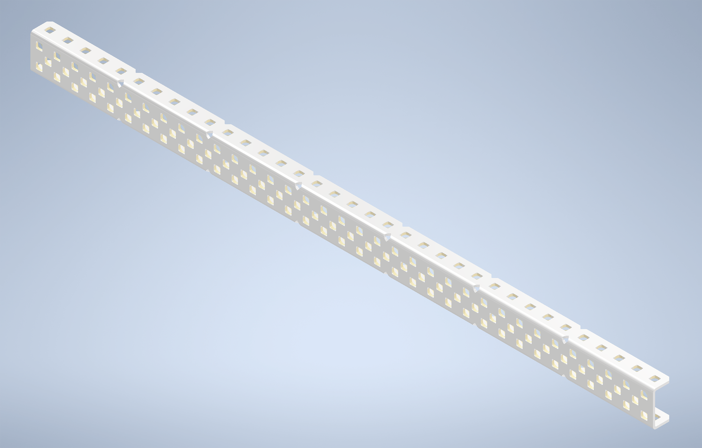
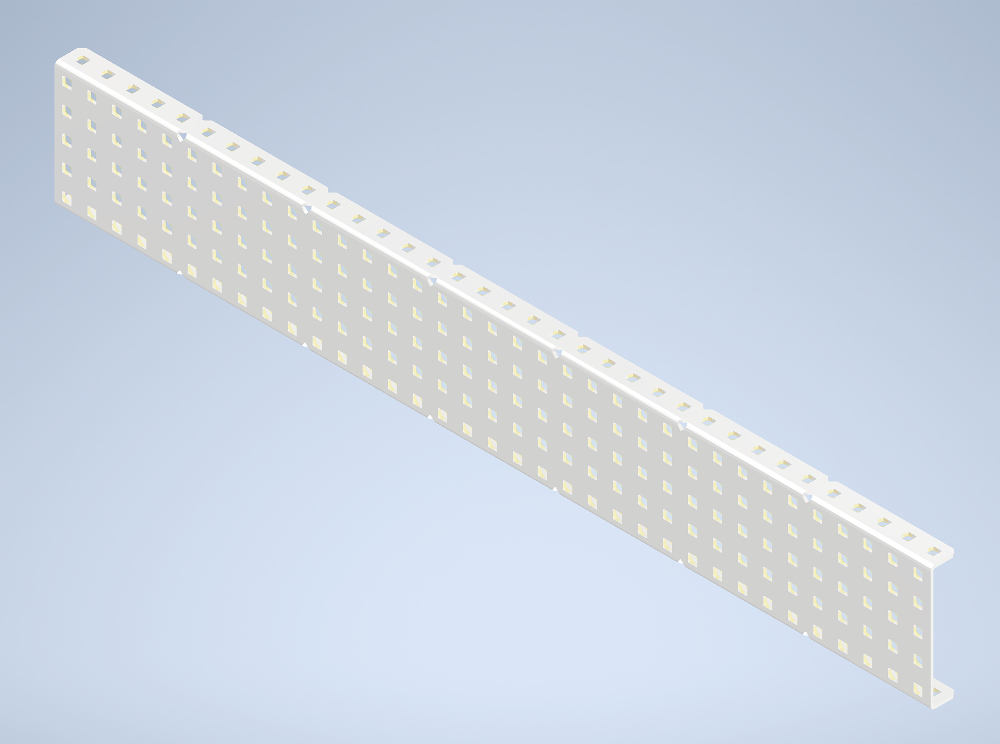
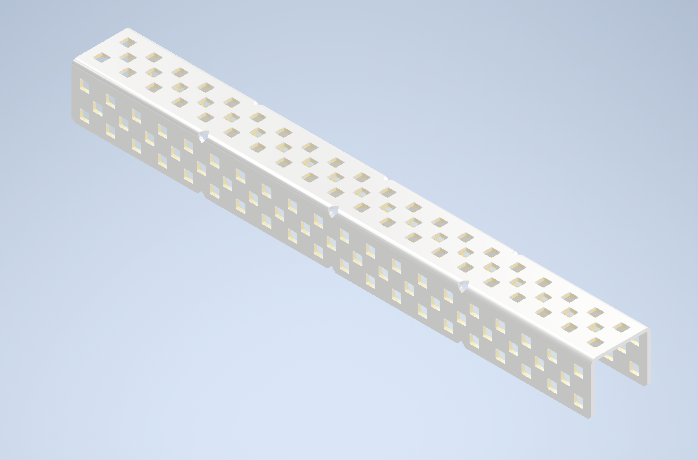

# C-Channels and Angles

The most commonly used type of metal in VEX, C-Channels provide a stable, secure grounding for a majority of subsystems that can be used. The “C” shape contains two corners, which give the C-Channel a strong, sturdy form, making it ideal for structural use and bracing. There are three variations of C-Channel, in terms of their width:

#### 2 Hole Width

This variety is the most used of the three, as the relatively small form factor makes it ideal for conserving space and weight.

#### 3 Hole Width

A balance between the smaller 2-hole and larger 5-hole widths, the 3-hole width c-channels are great for saving space and weight, while giving slightly more room for mounting subsystems to the chassis.

#### 5 Hole Width

The largest of the three widths, 5 hole width maximizes space for mounting, while taking up considerably more space and weight. Ideal for making your bot heavier, and less susceptible to defense as a result.

### U-Channel

A variation of the C-Channel, the U-Channel has an extra hole on the bracket portion of the stock, giving it a more “U” shaped appearance. This stock is great for bracing different towers and other supports, as the “U” shape can envelope the towers, adding additional space for box-bolts, making the towers more secure.

### Angle Bar

Forming the shape of an “L,” these stocks of metal have either 1 or 2 holes on each end of the L, forming a 1x1 or 2x2 angle bar. Both are mainly used for support, rather than as a main piece of structure.

#### 1x1 Bars

1x1 angle bars are mainly used for cross bracing, in the form of triangle or X bracing.

#### 2x2 Bars

2x2 angle bars can be used to brace to parallel towers, while providing additional mounting space in the up or down direction.

### Teams Contributed to this Article:

* [BLRS](https://purduesigbots.com/) (Purdue SIGBots)
