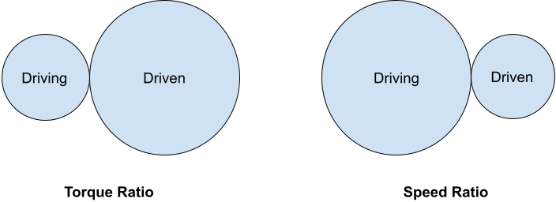
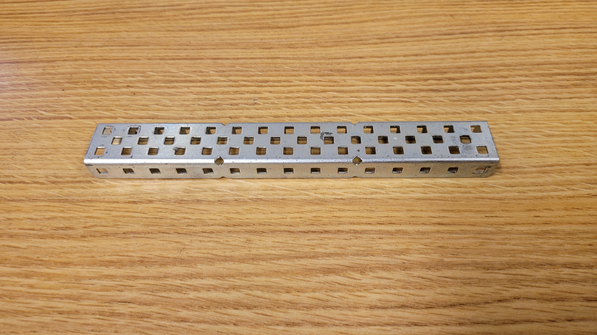
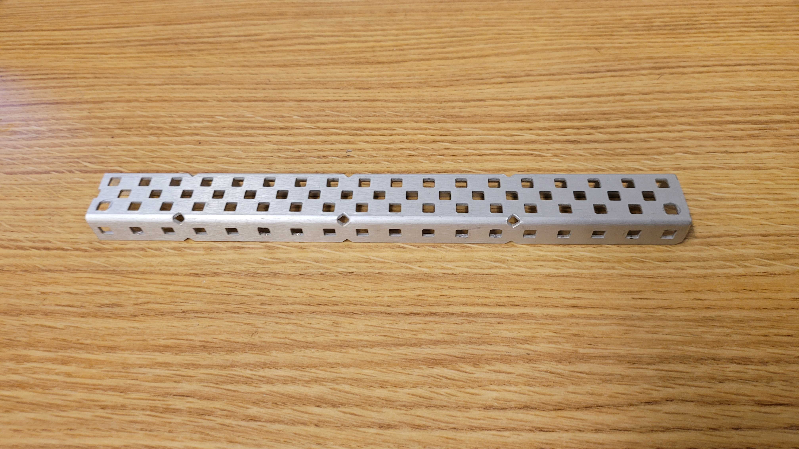
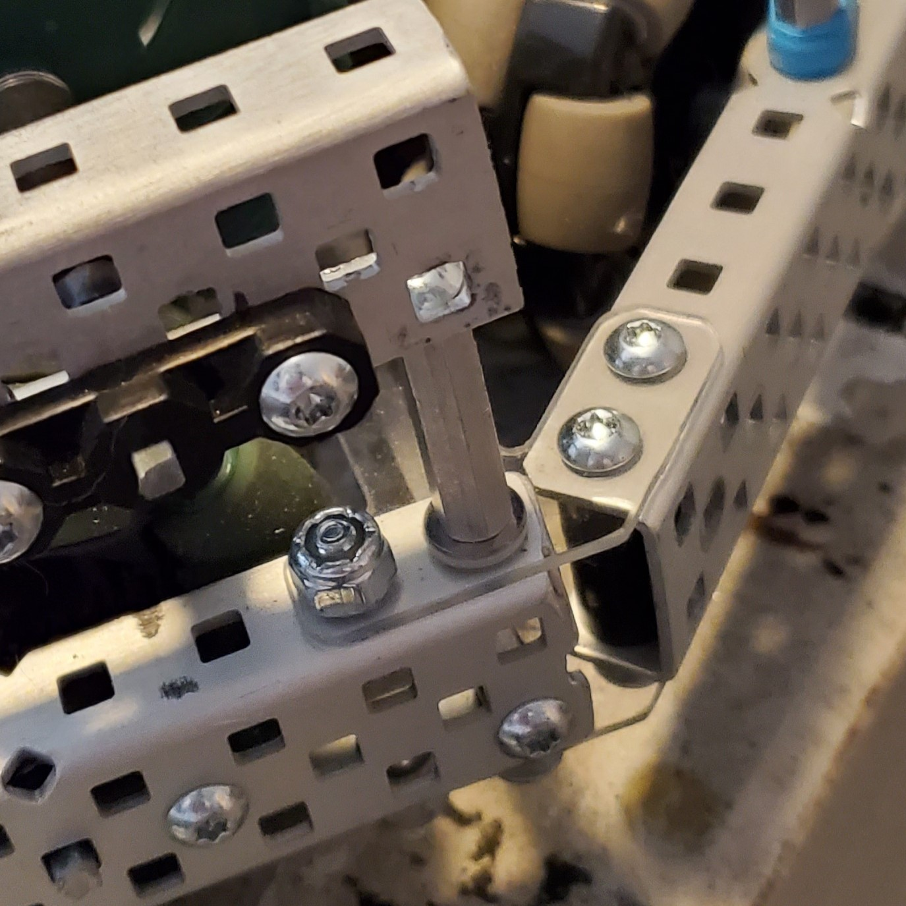
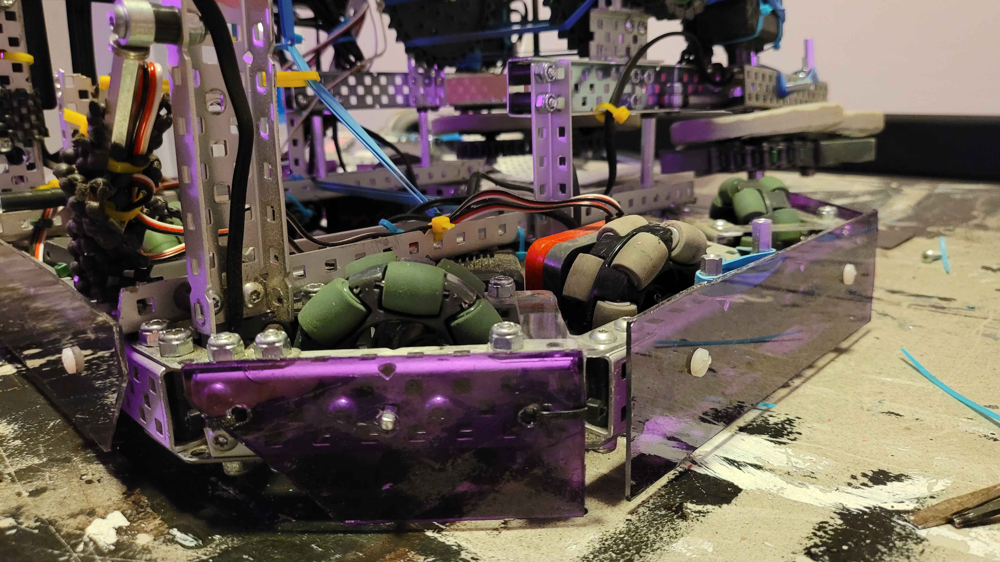
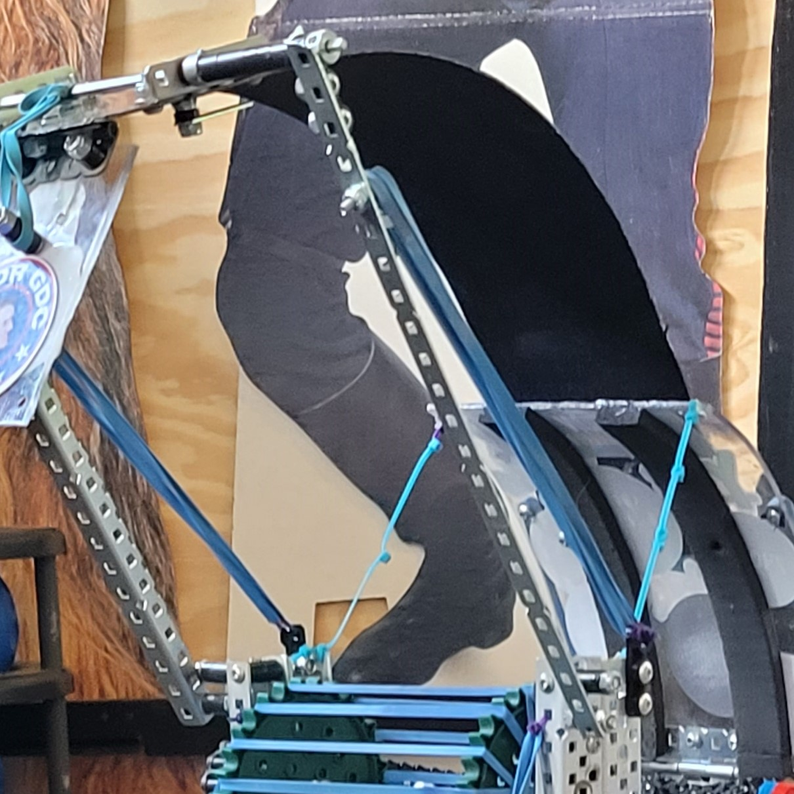

# Misc. Building Techniques

## Introduction

This page contains information that can be applied to a variety of subsystems on a robot in many different circumstances. If you are looking for more information on specific subsystems, such as [drive variations](vex-drivetrains/) and [lifts](lifts/), please see the corresponding articles in the sidebar.

## Gear and Sprocket Ratios

Gear and Sprocket Ratios are used in order to effect the torque or speed a motor provides when powered. Speed and torque have an inverse relationship with regards to Gear and Sprocket Ratios: as one increases, the other will decrease. Generally, the more weight a motor needs to manipulate, the more torque it will need to do so. Just as true, the less weight that a subsystem moves, the faster it can be geared.

When two gears or sprockets are linked together, they make a ratio of torque to speed. For instance, a 12 tooth gear powering an 84 tooth gear would be a 12:84, 1:7 simplified, ratio. A smaller driving gear (powered by a motor) and a larger driven gear (unpowered) increases the torque, while a larger driving gear) and a smaller driven gear will result in a faster ratio.

While ratios are more easily illustrated with gears, their use can also be accomplished with sprockets. As two sprockets are linked with chain or tread, they are, comparatively speaking, linked together in the same fashion as two gears. Therefore, the same principle applies, regarding ratios. Smaller driving sprockets will result in a torque ratio, while larger driving sprockets will result in a speed ratio.

## Metal and Motion

The half of this segment related to Motion can be summed up with one piece of advice: **all joints and axles should be supported with bearings.** The addition of bearings to joints and points of movement greatly reduces slop, friction, and creates a consistent rotation axis.

## Metal Material

While being a seemingly insignificant factor, choice in metal material can have a drastic impact on a robot's performance. There are two types of metal used in VEX products:

* Steel (Characterized by a darker, more reflective silver color)

* Aluminum (Characterized by a much lighter, powdered color)

### Characteristics

| Steel                  | Aluminum                 |
| ---------------------- | ------------------------ |
| Heavier Material       | Lighter Material         |
| More Rigid and Durable | Easier to Bend and Break |

### On the Robot

Due to its lighter weight, aluminum should be used in subsystems that need to be kept as light as possible, such as lifts and game piece manipulators.&#x20;

Steel is commonly used in areas where weight is less of a concern, or when a subsystem needs to be made heavier. In the event of a drive ratio favoring torque, a robot can be made heavier to help prevent being pushed by other robots.

As a general rule, however, aluminum should be used in the vast majority of places. Having a heavier robot, unless designed to be so, can be detrimental, and using aluminum instead of steel helps to drastically reduce the weight of a robot or subsystem.

## Washer Material

Similar to the material of metal used, different types of washers can have drastic effects on the performance of a subsystem.

| **Plastic Washer**       | **Metal Washer**           |
| ------------------------ | -------------------------- |
| Metal on Metal Contact   | Plastic on Plastic Contact |
| Metal on Plastic Contact | -                          |

Using plastic washers between two pieces of metal or metal and plastic helps to drastically reduce friction, and provides for a much more smooth rotation. In cases of plastic on plastic contact, metal washers provide the same benefits.

## Box Bracing

Box Bracing is a form of bracing that strengthens a subsystem comprised of c-channels, reducing slop, flexibility, and bending in the aforementioned bars. Box Bracing is composed of two c-channels, facing inwards towards each other, and attached together with a long screw running between both c-channels.

The space between the two c-channels should be filled with spacers wherever a screw runs between the c-channels in order to prevent over-tightening, which can deform the metal. Box Bracing is often used in coordination with other bracing techniques, which can be found [here](lifts/best-practices.md).

## Custom Plastic Parts

According to the current VRC rulebook, teams are allowed a certain amount of non-shattering plastic for use on robots. As rules can change from year to year, it is recommended that you check the rules for specifications on plastic amount and type.

There are many applications of custom plastic parts in VEX, some of which include, but are not limited to:

### Plastic Gussets

Using plastic to create custom gussets or brackets can be very beneficial when constructing angles not supported by VEX parts, or when designing with odd measurements. Whether by use of CAD or tin snips, using custom gussets or brackets can often lead to a more precise, stable mounting solution.

### Side Skirts/Guards

Side skirts/guards are created with long strips of plastic that run along the sides of a robot. These, in essence, are used to prevent things on the field from getting under the robot, providing a solid block that nothing can pass through. Side skirts/guards are ideal for preventing small game elements and other robots, especially, from getting under a chassis.&#x20;

Ideally, side skirts should be braced as low to the ground as possible, to prevent something trying to get under a robot from bending or breaking the plastic.

### Light/Flexible Main Components

As plastic is able to hold its shape well, it is therefore ideal for making light or flexible main components on a robot, especially components that require some form of flexibility or cannot be easily made with VEX parts.

While not required to have a well-performing robot, custom plastic parts allow for a large degree of flexibility when designing a robot, allowing for mounting at odd or specific angles, or in situations where normal VEX parts would not work or fit.&#x20;

## Chain Tensioners

The use of chain tensioners provides additional stability to large chain routes on a robot, reducing the likelihood of chain snapping during competition.&#x20;

Chain tensioners are often created by use of a [screw joint](vex-joints.md#single-bearing-screw-joint), with the exception of using free-spinning spacers instead of metal to rotate on the screw. As such, no bearing is necessary, as the screw will be stationary on the metal, and spacers require no bearings.

### Teams Contributed to this Article:

* [BLRS](https://purduesigbots.com/) (Purdue SIGBots)
* [94999E](https://www.youtube.com/channel/UCp1jTU7WF3PEVukDW3qOGpA) (Yokai Robotics)
