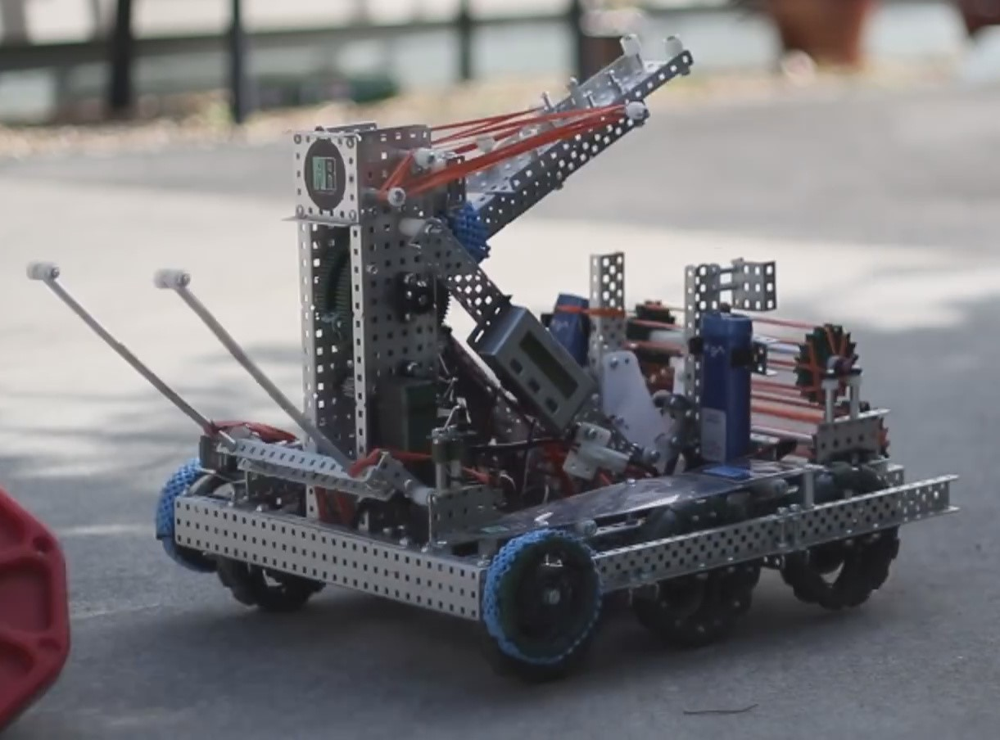
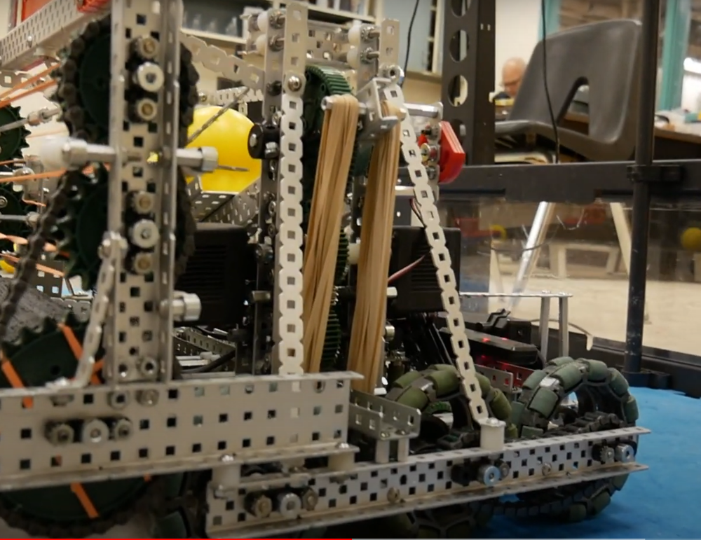
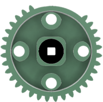

# Catapult

A catapult is a launching mechanism that utilizes rotational movement in order to fire objects. This is achieved by rotating an arm where an object placed at the end will gain momentum in the desired direction, and abruptly stopping the arm so that the object will continue its trajectory through the air. In VEX, catapults are often chosen because of their versatility, as they are able to easily launch any object regardless of shape or size, as well as being able to launch multiple objects simultaneously. Catapults have made several appearances throughout previous games, such as the 2013-2014 game Toss Up and the 2018-2019 game Turning Point.

## Elastic Catapult

Catapults powered by elastics (rubber bands, surgical tubing, etc.) are the most versatile and widely used method of applying force. There are many reasons why this is a popular design choice, however there are some _drawbacks._

| Pros                                                      | Cons                                                                                |
| --------------------------------------------------------- | ----------------------------------------------------------------------------------- |
| Easy to tune force by changing the amount of rubber bands | Places a large amount of stress on the robot due to the tension of the rubber bands |
| Force stays consistent throughout a match                 | Rubber bands need to be replaced often outside of matches                           |
| Can be powered a variety of ways                          | Requires lots of force to draw the catapult back                                    |

One of the benefits listed above was the ability to power an elastic catapult through a variety of ways, which are discussed below.

### Slip Gears

Slip gears are one of the ways where the rotational force of a motor is utilized to draw back and fire an elastic catapult. A slip gear is a gear that has several consecutive teeth shaven off, so that another gear driven by the slip gear will "slip" when it rotates to the section of the slip gear that has no teeth. Slip gears are often used in tandem with ratchets, to reduce the load on motors. These components are also commonly used in [linear punchers](linear-puncher.md).

For elastic catapults, the arm of the catapult is attached to a gear that is being driven by a slip gear. When the slip gear is rotated so that the shaven teeth are not engaging with the gear of the catapult, the catapult arm is able to rotate freely, allowing the built up tension from the elastics to rotate the catapult in the opposite direction.

Below is a video demonstrating how slip gears are used on catapults:


Animated demonstration of how a slip gear works, robot courtesy of 491A


#### Gear Ratios

The more elastic force applied on a catapult, the more torque the motor will need to provide in order to draw back the catapult. To accomplish this, gear ratios can be used to increase the output torque of the motor. For most catapults, a simple gear ratio of 1:5 or 1:7 can be used with 100 rpm motors. However, compound gear ratios can be used to fine-tune the output torque of your motor, so that you can power your catapult more efficiently.

### Additional Methods

Beyond slip gears, there are many other innovative ways to power a catapult which can be used to achieve the same effect:

#### Nautilus Gears/Cams

A nautilus gear/cams utilizes the changing outer radius to draw back the catapult, and fire when the radius drops off, as seen in this video:


Video from VexU team PVME1&#x20;


#### Connecting Rods

This method of powering allows for a fast rate of fire, without the need of using slip gears:


Video from WingusDingusRobotics (Team 7682)


## Pneumatic Catapults

[Pneumatics](../pneumatics.md) can also be used in a catapult to launch objects, as the quick actuation in tandem with a lever arm can be used to send objects flying through the air. As with elastic catapults, there are many pros and cons to this type of catapult:

| Pros                                                                         | Cons                                                     |
| ---------------------------------------------------------------------------- | -------------------------------------------------------- |
| Does not place constant stress on the robot                                  | Difficult to tune for a specific firing distance         |
| Does not require long terms purchases to maintain (unlike elastic catapults) | Force gets weaker as the catapult is used (air runs out) |
| Does not require much force to draw back                                     | Is limited to a specific range of motion                 |

Pneumatic catapults were extremely popular in the 2013-2014 game Toss Up, where teams would use pneumatics to launch the large, inflatable balls, as seen in this reveal video:


Video from Pastoral Invasion (Team 4252A)


## Optimization

Tuning a catapult to launch an object a specific distance can be tricky, so having the proper understanding of how certain factors can affect your shot can make a big difference in your catapult. There are three main aspects of a catapult that contribute to the arc of your object:

#### Rotational speed

The rotational speed of your catapult arm is the most obvious component of a catapult. The faster your arm swings, the faster your object will travel through the air. In VEX, the main contributor to the rotational speed is the amount of force that is being applied to your arm, whether it be rubber bands or pneumatic pressure. Increasing this will result in an increase in both the horizontal and vertical direction of your arc, and a decrease will do the opposite.

#### Length of arm

The distance between the object and the point of rotation, or the catapult arm, is very closely related to the rotational speed, and has similar effects. If an arm has a constant _angular_ speed, then an object placed farther away from the center will have a faster _linear_ than an object placed closer to the center. Because of this, catapults with longer arms will be able to launch objects further, and vice versa

#### Launch angle

Tuning the launch angle of a catapult will allow you fine tune the trajectory of your ball. The vertical height and horizontal distance of your trajectory will have opposite responses to a change in the launch angle. For example, if you change the launch angle to increase the vertical height of your object, then the horizontal distance will decrease, and the same is true for the other way around. Below you can see a diagram of how different launch angles result in different heights and distances. In VEX, the launch angle of a catapult can be changed by implementing or changing the hard-stop of the catapult. The hard-stop is what prevents a catapult from rotating past a certain angle, so changing this angle will change the launch angle.

 (1).png>)
