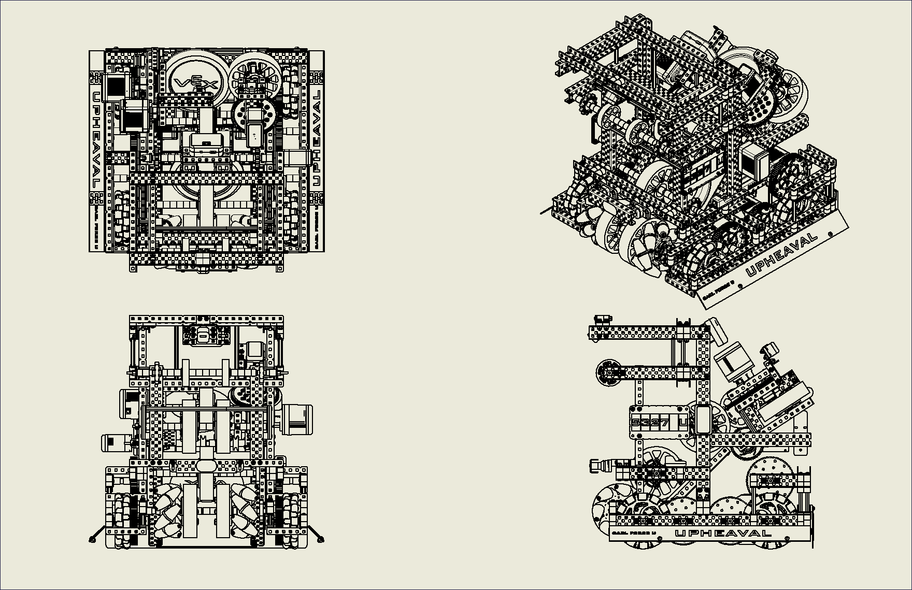
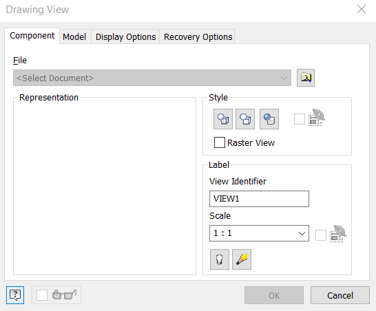
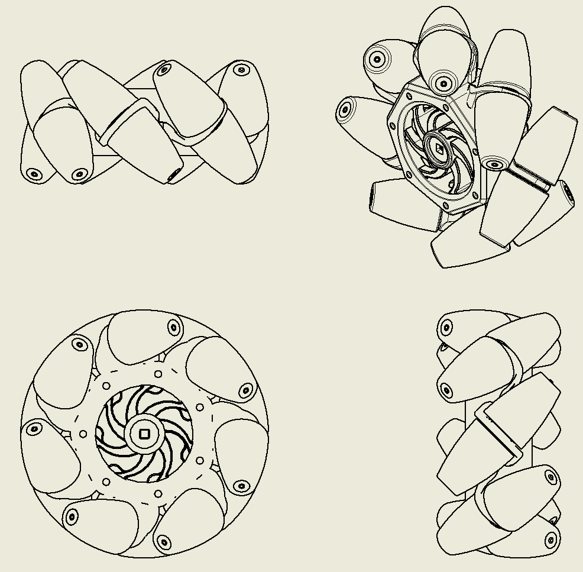

# Integrating Inventor Models into Documentation

## Displaying Assemblies

The simplest way to integrate CAD into documentation is to display the assembly file of the robot/mechanism as it appears in the software. This can be accomplished by simply screenshotting the assembly, although there are a few clever tricks that can be utilized to improve the appearance of the assembly, most of which appear in the "View" tab at the top of the window. Of course, these tips all depend on the amount of detail that a team is attempting to display in the documentation.

1.  **Know when to utilize orthographic view vs. perspective view**

    In most cases, it is best to opt for using the perspective view when displaying a robot assembly, as it looks more realistic since it more accurately represents the field of view of the human eye. However, orthographic view is generally better to use in more technical cases, such as a multi-view of the CAD model (although typically a team would use drawings to express this).
2.  **Use the "Realistic" visual style**

    While not particularly performance-friendly, the realistic visual style fleshes out the materials of the assembly to make them look significantly more polished. This is extremely useful when trying to show off a "finished product" CAD model in documentation, and it also opens the door for ray tracing to be activated in order to polish the assembly even further if necessary.
3.  **Make use of shadows**

    Similar to the Realistic visual style, enabling shadows is another aspect of Inventor's rendering abilities that, while also not performance-friendly, can make a design look more polished. However, in most use cases, it is best to only want to enable object shadows and ambient shadows, while ignoring ground shadows in order to make the model appear more seamless against the page in a team's documentation.
4.  **Temporarily change color settings before screenshotting or rendering**

    In Inventor, depending on the version, the default background being displayed behind the model usually does not coincide with the pages in of documentation very well. This could be solved by utilizing paint.NET or Adobe Photoshop to make the screenshot of the CAD model a PNG with a transparent background, but a much simpler method would just be to temporarily change the color settings in Inventor such that the background is a solid white color. To do this, go to the "Tools" tab at the top of the window, then click "Application Options". At the top of the Application Options window, navigate to "Colors", and then as the In-canvas Color Scheme, choose "Presentation". Finally, on the right, there should be a drop-down button under "Background". Instead of "Background Image" (which should be the default), change this setting to "1 Color", then click "Apply" at the very bottom of the window. This should make the background of Inventor a solid white color, making it much easier to seamlessly print out and paste onto a notebook or copy and paste into digital documentation.

## Creating Drawings of Models

One valuable feature of Autodesk Inventor is being able to import assemblies and parts alike as drawings. This makes it easy to display and annotate different views of a robot, mechanism, or part, all while maintaining an industry-like multi-view sketch scheme within the drawing file.

In order to create a drawing of a part or model, a DWG file or IDW file needs to be created. Inventor's default extension for drawing files is DWG, but there are few distinguishable differences between the two file extensions.&#x20;

Once the drawing file has been created,  the "Default Border" and "ANSI - Large" objects from the explorer can be deleted, unless it is preferred for a school or organization to use them as part of the drawing.

To import a model, click "Base" at the top of the window (under the "Place Views" tab). Another window will open which will ask to specify the file to generate a drawing for, the style of the drawing, and the scale of the drawing.&#x20;

First, select the file to display in the drawing file. Then, change the scale of the object accordingly. Usually, it is best to increase the ratio of small objects and decrease the ratio of large objects in order for them to take up a reasonable amount of space, although Inventor will try to do this automatically. Finally, the style of the drawing is dependent on what is being displayed; including hidden lines is potentially useful in the context of a small, simple part, but would make the entire drawing file look cluttered if enabled for a large, complex assembly like a robot, hence presenting a good reason to use the "Hidden Line Removed" option. Whether the drawing is shaded or not is up to preference, although it is usually good practice to leave the drawing unshaded. This option will not affect hidden lines. Clicking "OK" should close this window and generate the drawing of the base view.

.png>)

When importing the model, keep in mind that the base view should always be the flat view that shows the most features on the object. In this case, the top view of this mecanum wheel would be the base view. Once the base view is placed, the multi-view layout can now be generated. To do so, click "Projected" at the top of the Inventor window under the "Place Views" tab. Then, click on the base view. Once the cursor is moved away from the base view, an image of the model will appear. Moving the mouse along different axes will display a different view. Moving the mouse directly up will create a top view of the model. Moving the mouse to the right or left will create a side view of the model. Finally, moving the mouse diagonally from the model will create an isometric view of the model. Once it is determined that the optimal position of the projected view, left-click to place the view. Repeat this until there is a top view, side view, and isometric view present. Then right-click, and drag the mouse towards "Create" and let go once it's highlighted. This will complete the multi-view drawing.

The final step of integrating these drawings into documentation is to export the drawing. Click on "File" at the very top of the window, then click "Export", and select "Image". Drawings can then br exported as a BMP, GIF, JPEG, PNG, or TIFF file.

### Teams Contributed to this Article:

* [BLRS](https://purduesigbots.com/) (Purdue SIGBots)
* 5327U (Gael Force Robotics)
