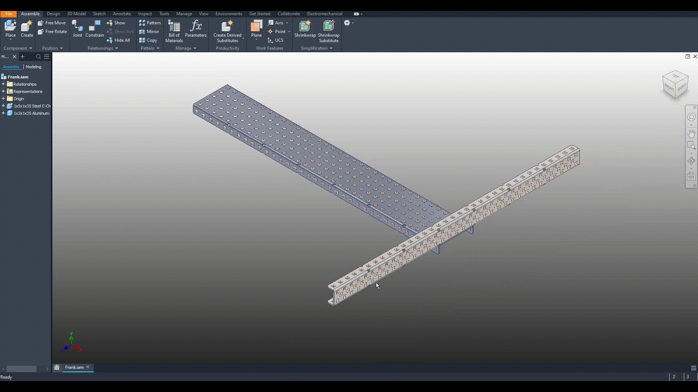

# Connecting Two C-Channels

## What are the Orange Cylinders?

The little orange cylinders in every hole are called `Construction Circles`.  CAD likes circles when connecting (constraining) parts together because it's easy for the software to find the center.

.png>)

## Connecting Two C-Channels

It's finally time to connect two c-channels together!  This is a two step process.  The first step is to use the insert constraint.  The second step is to use a mate constraint.&#x20;

### Insert Constraint

The insert constraint is special because it does two things for us, brings the c-channels together and aligns the hole. &#x20;

First we need to open the constraint window.  You can either press `C` on your keyboard, or go to `Assemble` in the ribbon and click `Constrain`.  Once the window opens, select `Insert`.

.png>)

Now we need to select the two holes we want to connect.  Because the insert constraint is bringing two faces together, we need to **select the sides of the part that will contact each other.**  In the gif below, I select the top of the 5x and the underneath of the 2x. &#x20;

After selecting both of your holes, click `Apply` in the constraint window.  You've successfully made your first constraint!

.png>)

.png>)

But there's an issue... if you select the 2x and drag it, it can rotate!  If we tried to screw two pieces of metal together with one screw, they would do the same thing in real life.  That's what's happening in here, it's only connected at one point.  We need to add our second "screw". &#x20;

### Mate Constraint

The insert constraint connected the two holes concentrically and made the two faces touch.  We need to make two new holes concentric to each other.&#x20;

By default the constraint window is on `Mate`, so we don't have to select anything here after opening it.&#x20;

.png>)

Now we select the **cylinders** we want to connect.  Hover your mouse over the body of the cylinder.  If you're in the right area, you'll see a green arrow appear in the center of the cylinder.  Select this for holes on both c channels.&#x20;

After selecting both of your holes, click `Apply` in the constraint window.  You've successfully fully constrained two c-channels!

### Final Check

If this was done correctly, you should be able to left click the two wide and drag your mouse around without anything moving.


Remember to save!


## Contributors to this Article:

* Jess - EZ
