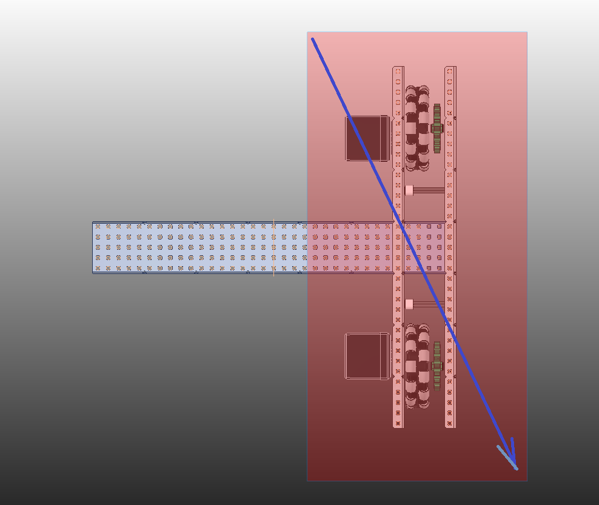

# Mirroring

## Mirroring

Please save your file with `ctrl+s` before mirroring!  

We are going to highlight the entire half of the drive.  Start by going to a top down view of the workspace in the navigation cube.  Start from the **TOP LEFT** of the red rectangle, and go down to the **BOTTOM RIGHT**.  Selecting in this direction will only select what is fully within the rectangle.  If you do this correctly, the highlight box will be **RED** and not **GREEN**. 

In the ribbon, make sure you're in the `Assemble` tab and select `Mirror`.

.png>)

Bellow is the default mirror window.  There are two colors are parts, green and yellow.  If we mirror with anything green, a new part will generate that is mirrored to the original part.  This becomes annoying when we are rapidly iterating and mirror multiple times, and now we have hundreds of unused files.  To make everything yellow, select the highest file, in my case, `Frank.iam`. 

Sometimes we need to create a new part, for example if there's an asymmetrically cut part on the drive.  In that case, it's okay to keep the those specific parts green. 

.png>)

After making everything yellow, at the bottom select `Ground New Components`.  Constraints will hold within what we are mirroring, but will not hold between the drive and the cross bar.  Best practice is to ground new components, and if you need something to move to manually unground those parts. 

.png>)

Select `Mirror Plane`, and select the `Work Plane` from the model browser on the left. 

.png>)

After selecting the mirror plane, your workspace should look like this.  Click `Next` in the mirror pop-up. 

.png>)

If we had any parts that needed to be mirrored (like an asymmetrically cut part on the drive), we would select where to save them here.  If we are okay with where they default to, then press `Ok`.

.png>)

If completed correctly, you have a drive base!

.png>)


Remember to save!


## Contributors to this Article:

* Jess - EZ
