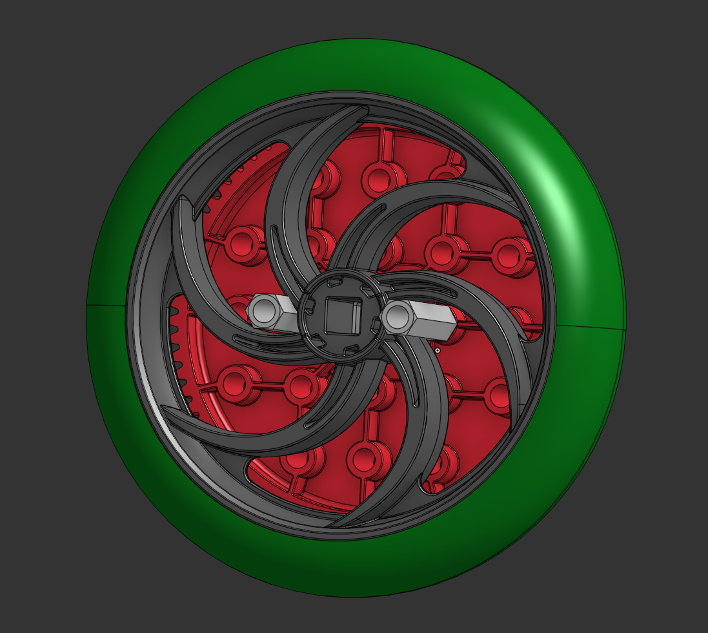

# 3-Wire Expander

.png>)

## Overview

The  VEX V5 3-Wire Expander is an electronic that acts as a method to provide eight additional [3-wire ports](../3-pin-adi-sensors/) while only using one [V5 port](./) on the [Brain](../../vex-electronics/vex-v5-brain/). This is useful when all eight 3-wire ports on the V5 Brain are already occupied, but more ADI sensors need to be used.&#x20;

The 3-Wire Expander can be attached to the robot via the attachment hole as well as the 0.05" long plastic peg on the bottom of the casing. The casing has very similar dimensions to the [V5 Rotation Sensor](rotation-sensor.md), meaning a 1" screw and nut should suffice for securing it.

## Usage

On the V5 Brain's "devices" UI, the 3-Wire Expander behaves exactly as the native 3-wire ports menu, showing inputs and outputs on ports A-H.

In [PROS](../../../software/vex-programming-software/pros/), a 3-Wire Expander is configured in conjunction with the devices that are plugged in. This means that the [PROS's TriPort API](https://pros.cs.purdue.edu/v5/api/cpp/adi.html) is used like normal, but the device being initiated will include an array of the smart port number of the 3-Wire Expander, then the 3-wire port letter being used on the 3-Wire Expander. For example, passing the parameters \{{1, "A"\}} will configure a device plugged into port A of the 3-Wire Expander that is plugged into port 1 of the V5 Brain.

In [VEXcode](../../../software/vex-programming-software/vex-coding-studio-vcs.md), the 3-Wire Expander is configured as a "source" for 3-wire ports to be recognized. This means that when a 3-wire device is configured, it will prompt you to select whether the 3-wire port is plugged into the brain or the recently configured 3-Wire Expander.

## Behavior

While the 3-Wire Expander practically provides no additional behavior compared to the basic 3-wire ports on the brain, it has been noted that the 3-Wire Expander is especially susceptible to electrostatic discharge, seemingly [more so than any other V5 electronic](../../vex-electronics/vex-v5-brain/v5-electronics-observations.md). Interestingly enough, it is more likely that the V5 port on the 3-Wire Expander will be rendered broken rather than the ports on the Brain. This is different from how V5 electronics typically behave, in which the Brain's ports usually face permanent damage before the electronic plugged into it would.

## Teams Contributed to this Article:

* [BLRS](https://purduesigbots.com/) (Purdue SIGBots)
