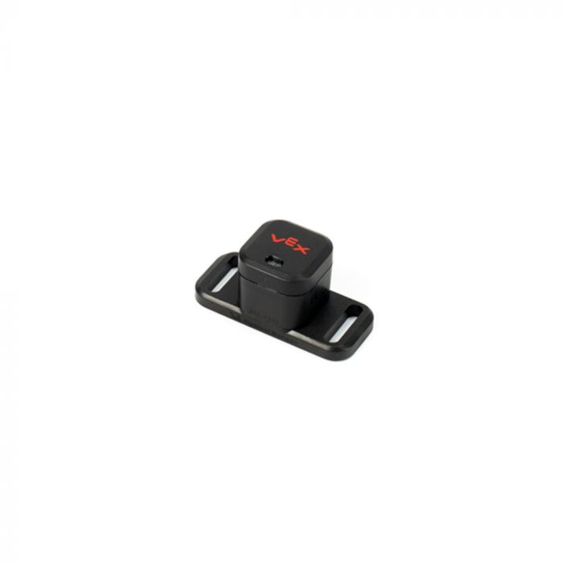

# Distance Sensor

## V5 Distance Sensor:

The **V5 Distance Sensor** is a rangefinder which uses a small laser reflecting off of an object to determine distance. It connects to the [V5 Brain](../vex-electronics/vex-v5-brain/) through a Smart Port on the top of the sensor.

The small laser inside the Distance Sensor uses a method called "Time of Flight" in order to measure the distance between an object. An incredibly accurate clock measures the time at which the laser is sent out, and the time at which the light receptor\(also inside the sensor\) receives the laser. The calculation is Distance\(m\) = Time\(s\) / \(2 \* Speed of Light\)\). The accuracy of this sensor is limited, as it has around a 5% error beyond 0.2 meters, and has a 0.015 meter error with distances closer than 0.2 meters. When programming, be sure to account for the potential sensor error.

Velocity of an object in relation to the sensor is also given by the V5 Distance Sensor, this is calculated by taking the delta value of the distance divided by a small period of time.

### Teams Contributed to this Article:

* MTBR \(Michigan Task Based Robotics\)

